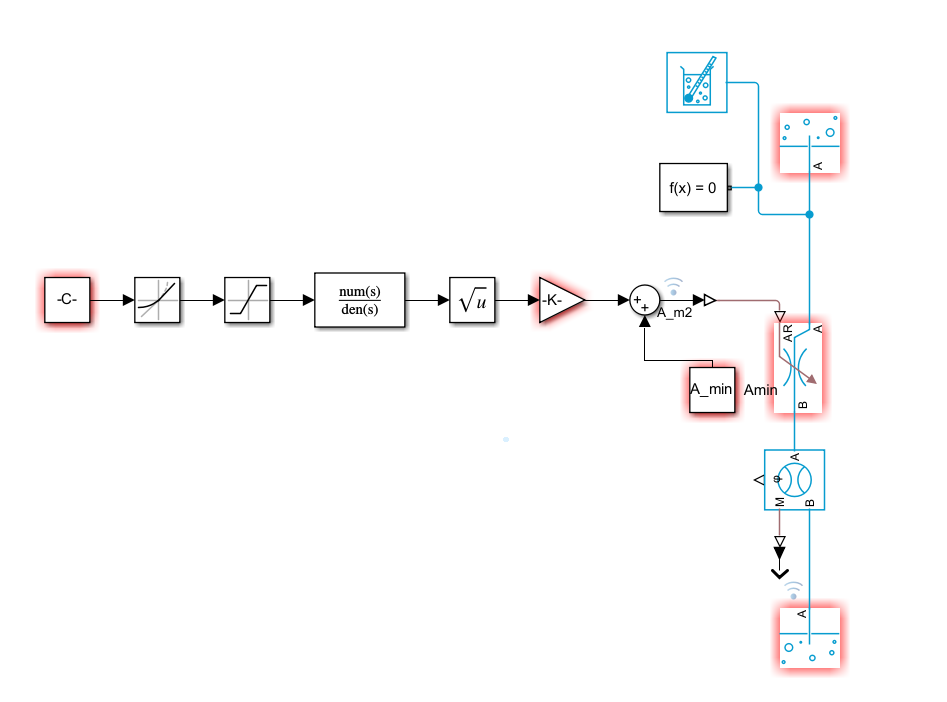
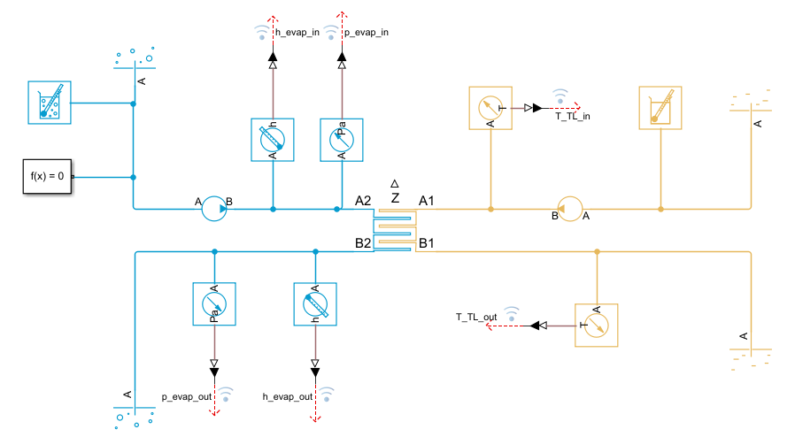
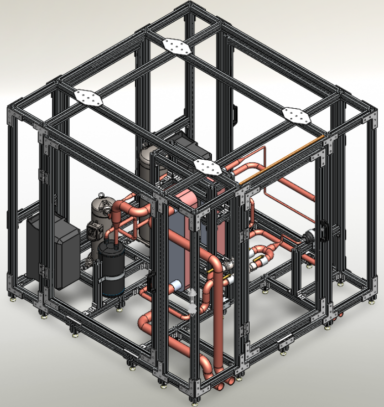

<h1 align="center">Daikin Valve Test Bench Digital Twin
</h2>
<table align="center">
  <tr>
    <th>Proposed Loop Design</th>
    <th>Simscape Implementation</th>
  </tr>
  <tr>
    <td align="center">
      
    </td>
    <td align="center">
      
    </td>
  </tr>
</table>

## What This Project Is 
This repository contains a **Simscape-based digital twin** of a vapor-compression refrigerant loop designed to support **expansion valve testing** (EXV/TXV). The model is built to answer the same questions an HVAC OEM would ask:

- Can the bench hit the required **ṁ–Δp valve test window** without exceeding pressure limits?
- Does **superheat control** have authority across operating points (no saturation/windup)?
- Does the system remain within **safe envelopes** under worst-case conditions?
- Are **water-side loads** and **energy balance** physically consistent?
- Does the loop behave safely during **startup and load transients**?

---
## System Architecture

- **Main model:** `model/MainBench.slx`
- **Control:** EXV PI superheat regulation (and TXV behavior where applicable)
- **Validation style:** phased “test suite” (component → open-loop → closed-loop → safety → energy → dynamics)

---
## Component-Level Models (Validation Harnesses)

<p align="center">
Each major physical component is modeled and validated independently
using dedicated Simscape harnesses prior to system integration.
</p>

<table align="center">
  <tr>
    <th colspan="2">Refrigerant-Side Components</th>
  </tr>
  <tr>
    <td align="center">
      <br>
      <sub>Variable-speed compressor harness</sub>
    </td>
    <td align="center">
      <br>
      <sub>Electronic expansion valve (open-loop / SH control)</sub>
    </td>
  </tr>
  <tr>
    <th colspan="2">Heat Exchangers</th>
  </tr>
  <tr>
    <td align="center">
      <br>
      <sub>Two-phase evaporator heat exchanger model</sub>
    </td>
    <td align="center">
      <br>
      <sub>Condenser heat exchanger with water-side coupling</sub>
    </td>
  </tr>
</table>


---
## Conceptual Mechanical Layout (CAD)

<p align="center">
  
</p>

<p align="center">
  <em>
  Conceptual mechanical layout used to reason about component placement,
  service access, routing feasibility, and instrumentation locations
  relevant to validation.
  </em>
</p>
> Note: This CAD is intentionally conceptual and is used for system integration
> and validation planning only; detailed manufacturing drawings are outside
> the scope of this work.


---
## Validation Framework

The validation is organized into sequential phases with pass/fail criteria and documented evidence.

- **Phase 0 — Requirements & acceptance criteria**
- **Phase 1 — Component harness validation**
- **Phase 2 — Open-loop cycle validation**
- **Phase 3 — Closed-loop SH control validation**
- **Phase 4 — Safety & worst-case envelope**
- **Phase 5 — Water-side sizing & energy balance**
- **Phase 6 — Dynamic transient validation (startup / load step)**
- **Phase 8 — Final validation report + traceability**
---

## Repo Structure
```
daikin-valve-testbench/
├─ README.md
├─ LICENSE
├─ .gitignore
│
├─ docs/
│  ├─ Validation_Manual.pdf
│  ├─ Design_Poster.pdf
│  ├─ Design_Poster.png
│  ├─ Schematic.pdf
│  ├─ Schematic.png
│  └─ resources/
│
├─ models/
│  ├─ main_cycle/
│  │  └─ MainBench_TwoPhase.slx
│  ├─ EES_code
│  └─ harness_components/
│     ├─ Harness_Compressor.slx
│     ├─ Harness_EXV_OpenLoop.slx
│     ├─ Harness_EvapHX.slx
│     └─ Harness_CondHX.slx
│
├─ tests_cases/
│  ├─ phase1_components/
│  │  ├─ tests_Compressor_MapGrid_v1.m
│  │  ├─ tests_EXV_mdot_dP_Window_v1.m
│  │  ├─ tests_EvapHX_UA_DeltaP_v1.m
│  │  └─ tests_CondHX_UA_DeltaP_v1.m
│  │
│  ├─ phase2_openloop/
│  │  ├─ tests_OpenLoop_OperatingGrid_v1.m
│  │  └─ tests_OpenLoop_mdot_dP_Coverage_v1.m
│  │
│  ├─ phase3_SH_control/
│  │  ├─ tests_SHControl_9ptGrid_v1.m
│  │  └─ tests_SH_SetpointSteps_v1.m
│  │
│  ├─ phase4_safety/
│  │  └─ tests_WorstCase_Envelope_v1.m
│  │
│  ├─ phase5_energy_water/
│  │  └─ tests_EnergyBalance_WaterDT_v1.m
│  │
│  └─ phase6_transients/
│     ├─ tests_Startup_v1.m
│     └─ tests_LoadStep_v1.m
│
├─ scripts/
│  ├─ run_phase1_components.m
│  ├─ run_phase2_openloop.m
│  ├─ run_phase3_SH_control.m
│  ├─ run_phase4_safety.m
│  ├─ run_phase5_energy_water.m
│  ├─ run_phase6_transients.m
│  ├─ run_validation_all.m
│  │
│  ├─ runners/
│  │  ├─ run_harness_Compressor.m
│  │  ├─ run_harness_EXV_OpenLoop.m
│  │  ├─ run_harness_EvapHX.m
│  │  ├─ run_harness_CondHX.m
│  │  └─ run_main_cycle_case.m
│  │
│  └─ postprocess/
│     ├─ plot_CompressorCurves.m
│     ├─ plot_EXV_mdot_dP_Map.m
│     ├─ plot_SH_StepResponse.m
│     ├─ plot_SafetyEnvelope.m
│     ├─ plot_EnergyBalance.m
│     ├─ plot_WaterSide_DT.m
│     └─ export_figures.m
│
├─ assets/
│  ├─ poster_thumb.png
│  ├─ schematic_thumb.png
│  ├─ mdot_dP_map.png
│  └─ sh_step.png
│
└─ results/
   ├─ phase1_components/
   ├─ phase2_openloop/
   ├─ phase3_SH_control/
   ├─ phase4_safety/
   ├─ phase5_energy_water/
   ├─ phase6_transients/
   └─ manifests/
      └─ run_manifest.csv
            
```

---
## Authorship & Attribution

This repository is maintained by **Aidan W.** as a portfolio-quality technical package derived from a senior design project context.

**Primary contributions**
- System architecture and model decomposition
- Simscape-based component and loop modeling
- Validation methodology and acceptance criteria
- Control integration and test-case execution
- Technical documentation and presentation assets

**Team context**
- University senior design collaboration  
- Contributor names are listed in the design poster and final report where applicable
